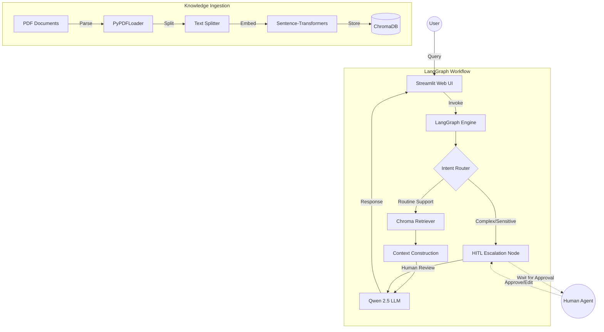

# High-Level Design (HLD): iSupport assistant

## 1. System Overview

### Problem Definition
Customer support teams often handle repetitive queries that can be answered using existing documentation. However, static FAQs are hard to navigate. A RAG-based system provides natural language answers based on a knowledge base, but it needs a way to handle complex or sensitive queries that require human intervention.

### Scope
The system will process PDF documents, answer user questions based on the content, and escalate queries to a human agent when intent is determined to be outside the bot's confidence or scope.

## 2. Architecture Diagram

## 3. Component Description

| Component | Description |
| :--- | :--- |
| **Document Loader** | Uses `PyPDFLoader` to extract text from multi-page PDFs. |
| **Chunking Strategy** | `RecursiveCharacterTextSplitter` with 1000-character chunks and 100-character overlap for context preservation. |
| **Embedding Model** | `all-MiniLM-L6-v2` - a fast, local transformer model for semantic vector generation. |
| **Vector Store** | `ChromaDB` for efficient similarity search and persistence. |
| **Retriever** | Similarity-based retrieval fetching top-K relevant chunks. |
| **LLM** | `Qwen 2.5 (7B)` running locally via Ollama for privacy and performance. |
| **Graph Engine** | `LangGraph` to orchestrate stateful logic and conditional routing. |
| **Routing Layer** | Analyzes user intent using LLM-based classification. |
| **HITL Module** | Implements breakpoints in the graph to pause execution for human verification. |

## 4. Data Flow

1.  **Ingestion**: PDF -> Text -> Chunks -> Embeddings -> ChromaDB.
2.  **Query Lifecycle**:
    *   User sends query via Streamlit.
    *   Graph starts; `intent_router` classifies the query.
    *   If routine: `retriever` pulls context; `generator` builds answer.
    *   If sensitive: Graph pauses (breakpoint); Human reviews in dashboard.
    *   Once approved/edited: Graph resumes; `generator` builds final answer.

## 5. Technology Choices

*   **ChromaDB**: Open-source, easy to run locally, and integrates perfectly with LangChain.
*   **LangGraph**: Allows for cyclical workflows and native support for state persistence and HITL.
*   **Qwen 2.5 (7B)**: State-of-the-art local model with excellent reasoning capabilities for its size.
*   **Streamlit**: Rapid development of a clean, interactive web interface.

## 6. Scalability Considerations

*   **Large Documents**: Handled by efficient chunking and vector indexing.
*   **Query Load**: Local LLM speed depends on hardware; horizontal scaling would involve a load balancer for Ollama instances.
*   **Latency**: MiniLM embeddings are extremely fast; Qwen 2.5 quantized versions can be used to optimize inference speed.
